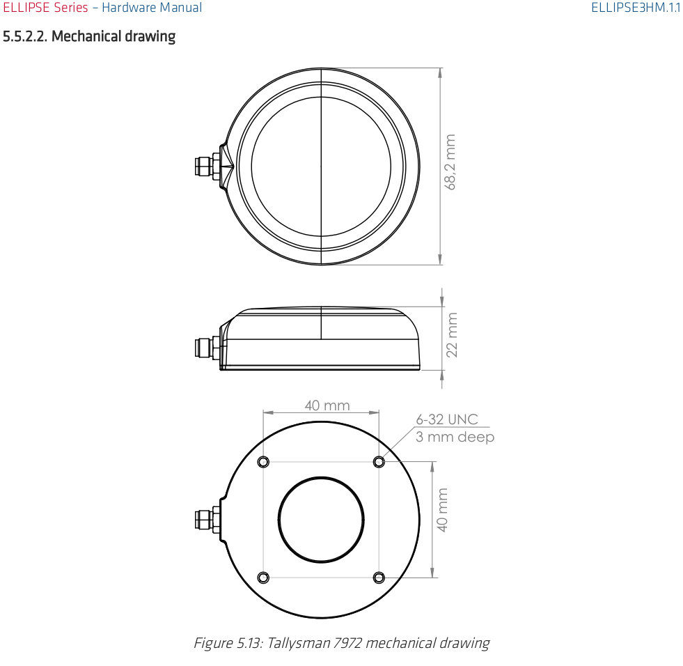
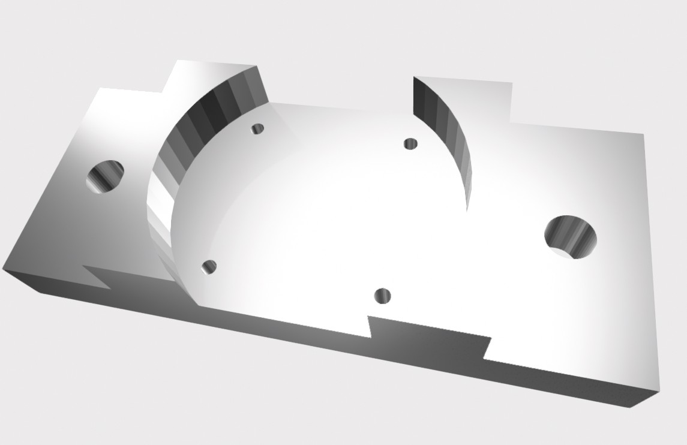

# SBG Antenna Mount

This mount is to hold the 2 antennas we have for the SGB IMU/INS/GNSS system.
The screw holes are there, but should be optional in terms of that it should
also fit the inner diameter holder

## CAD Drawings

## Example Render

